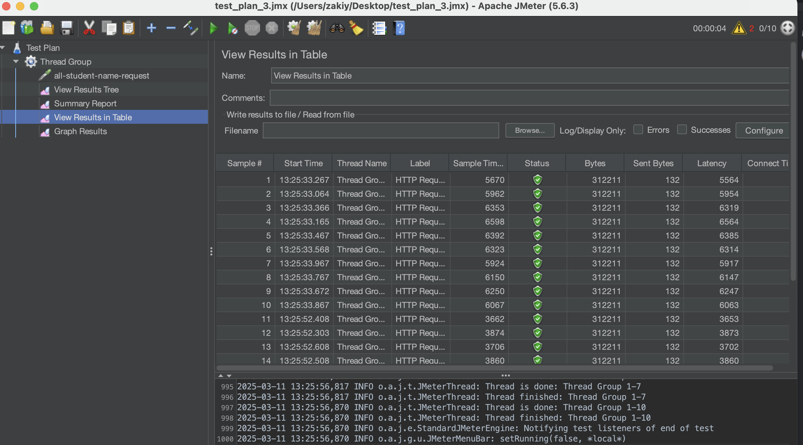
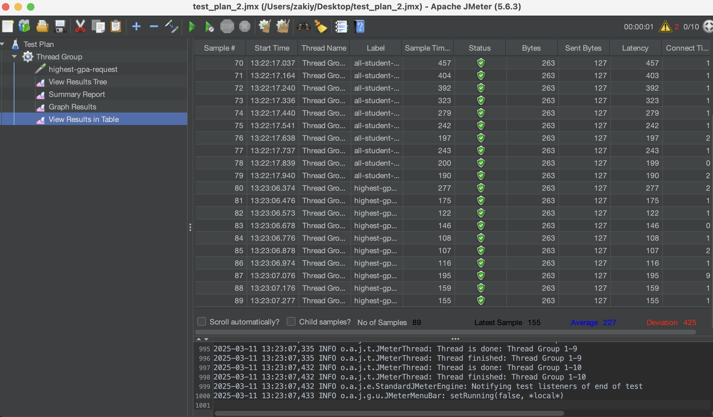

### MODULE 5 REFLECTION
### Before Optimization

## /all-student

.png)
## /all-student-name

.png)
## /highest-gpa

.png)
Conclusion: there was a big improvement after doing optimization on the code
Questions:
What is the difference between the approach of performance testing with JMeter and profiling with IntelliJ Profiler in the context of optimizing application performance?
When we used Jmeter, we simulated 10 users for the test. It is more focused on testing the bottlenecks of the application. The intellij profiler is used to determine
which aspects of the code in the application takes up the most resources.

How does the profiling process help you in identifying and understanding the weak points in your application?
It helps me by showing which methods take the longest time to execute in the application. Once I know which method takes the longest time,I can
try to optimize the method, so that the overall runtime of application will be faster. 

Do you think IntelliJ Profiler is effective in assisting you to analyze and identify bottlenecks in your application code?
Yes as it directly tells me which method is taking up the most resources. It's also easy to use and understand. 

What are the main challenges you face when conducting performance testing and profiling, and how do you overcome these challenges?
Sometimes, When trying to improve a code that it was difficult to make it run more efficient because the runtime was already very short. When trying to optimize the highest gpa, I couldn't get it
to go any faster than around 200ms. I eventually found out that I could modify the student repository to use an SQL query, which made the highestgpa method a lot better.Also, when doing the 
performance testing in Jmeter I couldn't get Jmeter to connect to the application, so it kept giving back failed test results. I overcame the Jmeter issue by restarting Jmeter and making 
sure I put inputted the right setting in Jmeter. 

What are the main benefits you gain from using IntelliJ Profiler for profiling your application code?
The main benefits is to give us the ability to make our code run faster. This is done by seeing the graphs in the report of the profiler and see which methods were the costliest.I can then
try to optimize those methods to make my overall application run faster.

How do you handle situations where the results from profiling with IntelliJ Profiler are not entirely consistent with findings from performance testing using JMeter?
I'll try to check if there are any external factors that could affect the results, and then try to mitigate the effects. Then I try to run the tests multiple times to see if the consistency improved. 

What strategies do you implement in optimizing application code after analyzing results from performance testing and profiling? How do you ensure the changes you make do not affect the application's functionality?
I use the flame graph in the intellij profiler to see which method takes the highest CPU time. I then see what the method does and try to optimize with various techniques (removing redundant database query, nested loops,etc.)
Then I run the application again and make sure that the functionality of the method did not change.

